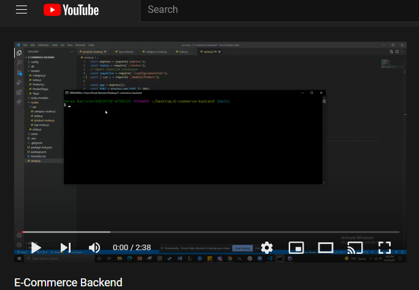

# E-Commerce Backend

**This application is a back end for a e-commerce site. It uses Express.Js, Sequelize, and MySQL and performs basic RESTful CRUD operations. This application allows users to manipulate a database which consists of products, categories, and tags. Below is a youtube video showing the functionality of this project.**

## Built With

* [Javascript](https://www.javascript.com/)
* [Node.Js](https://nodejs.org/en/)
* [Express.Js](https://expressjs.com/)
* [MySQL](https://www.mysql.com/)
* [Sequelize](https://www.npmjs.com/package/sequelize)

## Instructions
Steps to install application:

1. Clone repository.
2. Run npm install
3. Make sure you have a .env file setup as well as MySQL installed.
3. Run npm run seed in command line to seed the database.
4. Run NPM Start to turn on your server
5. Test routes/endpoints/CRUD Operations using Insomnia or Postman.

## Authors

* **DEREK BANISTER** 

- [Link to Portfolio Site](https://derekbanister.github.io/portfolio-two/)
- [Link to Github](https://github.com/DerekBanister)
- [Link to LinkedIn](https://www.linkedin.com/in/derek-banister/)